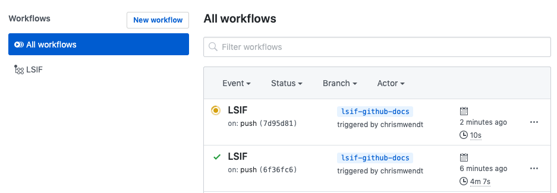

# LSIF on GitHub

You can use [GitHub Actions](https://help.github.com/en/github/automating-your-workflow-with-github-actions/about-github-actions) to index LSIF data and upload it to your Sourcegraph instance.

LSIF indexing actions for each language:

- [Go indexer action](https://github.com/marketplace/actions/sourcegraph-go-lsif-indexer)
- ...and more coming soon!

And there is one [LSIF upload action](https://github.com/marketplace/actions/sourcegraph-lsif-uploader).

## Setup

Create a [workflow file](https://help.github.com/en/github/automating-your-workflow-with-github-actions/configuring-a-workflow#creating-a-workflow-file) `.github/workflows/lsif.yaml` in your repository.

The basic flow is to first generate LSIF data then upload it. Here's an example for generating LSIF data for a Go project:

```yaml
name: LSIF
on:
  - push
jobs:
  build:
    runs-on: ubuntu-latest
    steps:
      - uses: actions/checkout@v1
      - name: Generate LSIF Data
        uses: sourcegraph/lsif-go-action@master
        with:
          verbose: "true"
      - name: Upload LSIF data
        uses: sourcegraph/lsif-upload-action@master
        with:
          public_repo_github_token: ${{ secrets.PUBLIC_REPO_GITHUB_TOKEN }}
```

Once that workflow is committed to your repository, you will start to see LSIF workflows in the Actions tab of your repository (e.g. https://github.com/sourcegraph/sourcegraph/actions).



After the workflow succeeds, you should see LSIF-powered code intelligence on your repository on Sourcegraph.com or on GitHub with the [Sourcegraph browser extension](../../integration/browser_extension)
